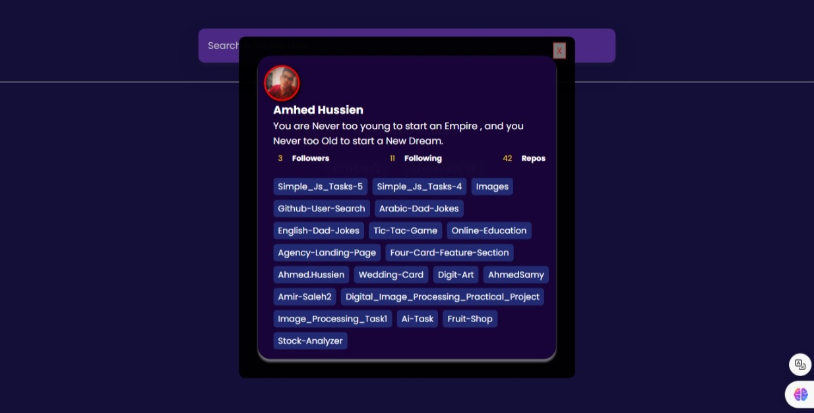

# GitHub User Search

## Overview
GitHub User Search is a web application that allows users to search for GitHub profiles and view detailed information about each user, including their followers, following, and repositories.

## Features
- **User Search:** Search for GitHub users by their username.
- **Profile Overview:** View detailed information about a selected user, including their avatar, followers, following, and repositories.
- **Direct Links:** Direct links to the user's GitHub profile and repositories.
- **Responsive Design:** Optimized for various screen sizes and devices.

## Technologies Used
- HTML5
- CSS3
- JavaScript (ES6)
- Axios for API requests

## Demo
- You can Try out  online **[From_Here](https://eng-ahmed-hussien.github.io/Github-User-Search/)**.

## Usage
1. Enter a GitHub username in the search bar.
2. Click on the "GitHub" button to visit the user's GitHub profile.
3. Click on the "Overview" button to view detailed information about the user.

## How to Get a GitHub Personal Access Token
1. Go to [GitHub Settings](https://github.com/settings/tokens).
2. Click on "Generate new token".
3. Select the scopes for the token (e.g., `repo`).
4. Click "Generate token".
